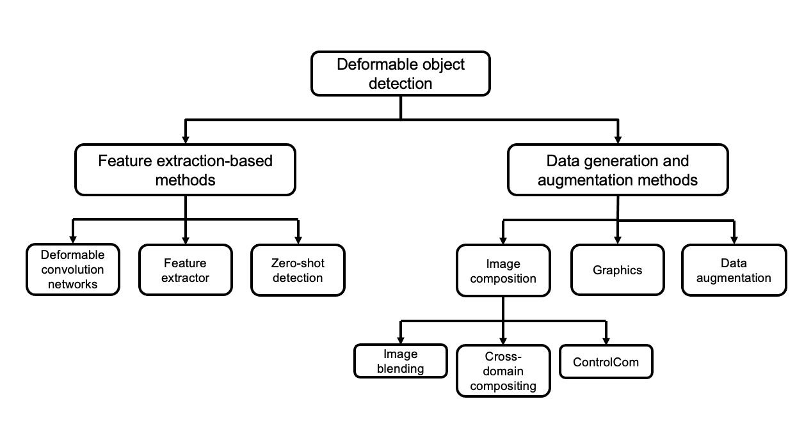

# Robotic Detection of Deformed Objects for Marine Debris Management
This repository contains the resources for methods used in the paper Robotic Detection of Deformed Objects for Marine Debris Management.

## Methods

## Resources
- [YOLACT](https://github.com/dbolya/yolact)
- 

## License
Distributed under the GPL-3.0 license. See `LICENSE.txt` for more information.

<!-- ## Bibliogrphy entry -->
